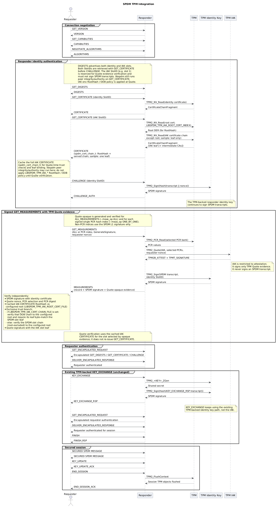

# TPM Support

## Overview

This implementation uses a Trusted Platform Module (TPM) to protect SPDM keys and produce
measurement evidence by:

- Storing device private keys securely
- Performing cryptographic signing operations
- Providing certificates and measurement data
- Attesting PCR values with a restricted Initial Attestation Key (IAK)

The requester-configured certificate roots and verification policy remain the SPDM trust
anchors. Testing uses a software TPM (`swtpm`), so the flow can be validated without
physical TPM hardware.

This document is the primary TPM user guide: supported flows, build and provisioning,
provisioned objects, validation, and security considerations. For deeper Quote design
(component architecture, OpaqueData wire format, verification sequence, and limitations)
and the security-property discussion in design §10, see
[TPM Quote Measurement Evidence Design](tpm_quote_design.md).

---

## Supported SPDM Flows

- GET_CERTIFICATE
- CHALLENGE / CHALLENGE_AUTH
- GET_MEASUREMENTS
- KEY_EXCHANGE / KEY_EXCHANGE_RSP



The identity SlotID and IAK SlotID are both retrieved with `GET_CERTIFICATE` after
`GET_DIGESTS` and before `CHALLENGE`. The requester caches that IAK `CERTIFICATE` buffer;
Quote verification uses the cached slot and does not issue certificate requests after
receiving `MEASUREMENTS`. IAK CertChain shape, RootHash, and optional OOB trust
configuration are defined in [NV Indices](#nv-indices).

---

## Implementation

TPM-backed functionality is implemented in `libspdm` under:

```text
os_stub/spdm_device_secret_lib_tpm/
```

### Components

- `read_pub_cert.c` – Retrieves certificates from TPM NV storage
- `meas.c` – Provides TPM-backed measurements
- `sign.c` – Signs CHALLENGE, MEASUREMENTS, and KEY_EXCHANGE transcripts using
  TPM-resident keys

---

## Dependencies and Build

On Debian or Ubuntu, install the runtime and development dependencies:

```sh
sudo apt-get install tpm2-openssl tpm2-tools swtpm swtpm-tools \
  libtss2-dev libglib2.0-dev
```

End-to-end order:

1. **Build** the TPM variant (from the repository root).
2. **Provision** keys with `setup-tpm.sh` from `build/bin` (export both TCTI
   variables first).
3. **Run** the emulators from `build/bin` with the same TCTI exports and
   requester trust configuration.

Configure and build the TPM variant:

```sh
cmake -S . -B build -DARCH=x64 -DTOOLCHAIN=GCC \
  -DTARGET=Debug -DCRYPTO=openssl -DDEVICE=tpm \
  -DLIBSPDM_TPM_SUPPORT=ON
cmake --build build -j
```

The TPM implementation requires OpenSSL. Other crypto backends are rejected when
`LIBSPDM_TPM_SUPPORT` is enabled.

The principal TPM CMake settings are:

- `LIBSPDM_TPM_RESPONDER_SLOT_IDS`, `LIBSPDM_TPM_RESPONDER_HANDLES`, and
  `LIBSPDM_TPM_RESPONDER_CERTCHAINS` map responder slots to TPM objects.
- `LIBSPDM_TPM_IAK_SLOT_ID` and `LIBSPDM_TPM_IAK_HANDLE` select the Quote IAK.
- `LIBSPDM_TPM_IAK_ROOT_CERT_INDEX` selects the root certificate used only to construct
  the SPDM CertChain `RootHash`; the root is not sent in slot 1.
- `LIBSPDM_TPM_VENDOR_ID` identifies the device or evidence provider in the TCG structured
  vendor-defined opaque element.
- `LIBSPDM_TPM_IAK_BASE_ASYM_ALGO` and `LIBSPDM_TPM_IAK_BASE_HASH_ALGO` describe the
  provisioned IAK certificate.

If OpenSSL cannot locate the TPM provider, set `OPENSSL_MODULES` for the distribution
before provisioning or running the emulators:

```sh
# For Debian/Ubuntu
export OPENSSL_MODULES=/usr/lib/$(uname -m)-linux-gnu/ossl-modules

# For RHEL/Fedora
export OPENSSL_MODULES=/usr/lib64/ossl-modules

# For ArchLinux
export OPENSSL_MODULES=/usr/lib/ossl-modules
```

---

## TPM Setup

Do not run this script with root permissions. Export both TCTI settings before the script
because provisioning uses tpm2-tools and the OpenSSL TPM provider:

```sh
export TPM2TOOLS_TCTI="swtpm:port=2321"
export TPM2OPENSSL_TCTI="swtpm:port=2321"

cd build/bin
../../script/setup-tpm.sh --cleanup --start-swtpm
```

`--start-swtpm` starts a software TPM on ports 2321 and 2322 with a temporary state
directory. Add `--wait-swtpm` to keep the script in the foreground. Without
`--start-swtpm`, configure the TCTI values for the target TPM before running the script.

The script changes persistent handles and NV indices. Treat it as sample provisioning
only; inspect existing objects before adapting it to physical hardware.

---

## TPM Provisioned Objects

### Persistent Handles

| Name     | Handle     |
| -------- | ---------- |
| REQU_KEY | 0x81000011 |
| RESP_KEY | 0x81000021 |
| IAK_KEY  | 0x81020001 |

The setup script keeps storage parents transient. It temporarily persists the root CA key
at `0x81000001` while provisioning certificates, removes that key, then persists the
runtime IAK at `0x81020001`. This avoids retaining a provisioning-only CA key.

The IAK uses the TCG-assigned persistent OEM handle `0x81020001`. The sample responder
identity key is not currently provisioned as an IDevID; an OEM that provisions it as an
IDevID must use `0x81020000`.

The default responder maps identity keys to slots 0 and 4 and the IAK certificate to slot 1.
Slot 1 is reserved for IAK evidence verification and is not permitted to sign an SPDM
transcript.

The setup script creates a restricted, fixed-TPM signing AK under an endorsement key. This
is sufficient for the sample Quote flow, but it does not implement the recoverable
primary-key templates and delegated authorization policies described in Sections 7.3.4 and
7.4 of the TCG specification. Products claiming that provisioning profile must replace the
sample key creation with their OEM template and policy.

---

### NV Indices

| Name            | Index      |
| --------------- | ---------- |
| ROOT_CERT       | 0x01500000 |
| REQU_CERT       | 0x01500010 |
| RESP_CERT       | 0x01500020 |
| REQU_CERT_CHAIN | 0x01500011 |
| RESP_CERT_CHAIN | 0x01500021 |
| IAK_CERT        | 0x01C90100 |

The IAK certificate uses index 0 of the TCG-assigned IAK certificate-chain range
(`0x01C90100` through `0x01C901FF`). That NV index may store a concatenated DER chain
except the root (TCG-style). The sample writes leaf-only DER; products may provision
intermediates then leaf. The root used for SPDM `RootHash` is read from a separate index
(`LIBSPDM_TPM_IAK_ROOT_CERT_INDEX`, sample `0x01500000`) and is not stored in IAK NV or
sent in the IAK slot certificate portion. The setup script's IAK leaf is signed directly
by the root; the requester configures that root independently as its trust anchor.

`LIBSPDM_TPM_IAK_ROOT_CERT_FILE` is always required. Optionally configure
`LIBSPDM_TPM_IAK_CERT_CHAIN_FILE` with the complete verification chain ordered root,
optional intermediates, then the same IAK leaf. When the chain file is unset, the
requester verifies the SPDM slot chain (root-excluded) against that root—sufficient for
sample leaf-only NV, or when intermediates are already in the slot. When intermediates are
required but absent from the SPDM slot, set the external chain file.

Both files use DER encoding. The chain file is a raw concatenation of certificates, not
PEM or PKCS#7. See Section 7.3.2 of the
[TCG TPM 2.0 Keys for Device Identity and Attestation specification](https://trustedcomputinggroup.org/wp-content/uploads/TPM-2.0-Keys-for-Device-Identity-and-Attestation-v1.10r9_pub.pdf)
for the assigned NV ranges and certificate-chain storage rules.

---

## Running the Responder

After `setup-tpm.sh`, keep both TCTI exports in the emulator shell (a new shell does not
inherit them). `TPM2TOOLS_TCTI` covers Esys Quote/PCR and NV reads; `TPM2OPENSSL_TCTI`
covers OpenSSL TPM provider signing. See
[design §9](tpm_quote_design.md#9-build-time-and-runtime-configuration).

```sh
export TPM2TOOLS_TCTI="swtpm:port=2321"
export TPM2OPENSSL_TCTI="swtpm:port=2321"
./spdm_responder_emu
```

Bare `./spdm_responder_emu` is enough for identity and certificate smoke tests. For Quote
validation, start the responder with SPDM 1.2+, OpaqueDataFmt1, and matching hash/asym
algorithms, and set `LIBSPDM_TPM_IAK_ROOT_CERT_FILE` on the requester. See
[Validation Procedure](#validation-procedure) for the full command line and expected
`TPM Quote verification - PASS` output.

---

## Validation Procedure

### GET_CERTIFICATE

Retrieves certificates from TPM NV storage. For the IAK slot (default slot 1), the served
`CERTIFICATE` is `spdm_cert_chain_t` as described in [NV Indices](#nv-indices). Quote
verification always requires the configured requester root.

### CHALLENGE_AUTH

The TPM-backed responder identity key signs the SPDM challenge transcript.

### GET_MEASUREMENTS

For signed SPDM 1.2 or later requests covering PCR measurement blocks (`ALL_MEASUREMENTS`
or a single PCR hash index with `GenerateSignature`), returns both layers of evidence:

- `measurement_record` contains PCR values.
- `signature` is the normal SPDM transcript signature made with slot 0.
- OpaqueDataFmt1 contains a TCG element with the TSS2-MU encoded `TPM2B_ATTEST` and
  `TPMT_SIGNATURE`. The Quote `extraData` is exactly the 32-byte requester nonce.

Signed non-PCR measurement indices (SVN, HEM, Manifest, DEVICE_MODE) return no Quote
opaque and rely on the SPDM L1 transcript signature alone.

The TCG element payload is:

```text
version:u8 | iak_slot_id:u8 | attest_len:u16le | signature_len:u16le |
TPM2B_ATTEST | TPMT_SIGNATURE
```

For the eight hashed sample measurement blocks, SPDM measurement block index `N` maps to
PCR `N - 1`; indices 1 through 8 therefore quote PCRs 0 through 7. `ALL_MEASUREMENTS`
quotes the full set (`pcr_mask = 0xFF`); a single-index request quotes only that PCR. The
selected PCR bank is the negotiated SPDM measurement hash algorithm.

`LIBSPDM_TPM_VENDOR_ID` is the registered 16-bit ID in the TCG SVH (sample default
`0x1014`; override for the device/evidence provider). It is not taken from
`TPM2_PT_MANUFACTURER`; see [design §7](tpm_quote_design.md#7-opaquedata-wire-format).
The requester rejects mismatched VendorID.

TPM support automatically enables `LIBSPDM_ENABLE_MEASUREMENT_OPAQUE_DATA_EX`; see
[design §5](tpm_quote_design.md#5-generic-extended-opaquedata-interface) for the callback
contract and non-TPM use.

IAK CertChain shape, RootHash, and OOB chain env vars are defined in
[NV Indices](#nv-indices). The requester authenticates Quote evidence by:

1. Loading the required DER trust anchor (`LIBSPDM_TPM_IAK_ROOT_CERT_FILE`) and optional
   external chain file.
2. Using the IAK `CERTIFICATE` cached during authentication for the opaque `iak_slot_id`,
   binding RootHash and leaf per the CertChain / OOB rules in
   [NV Indices](#nv-indices). Quote signature verification always uses the SPDM slot leaf.
3. Failing closed if the root is missing, the cached slot certificate is unavailable, or
   trust checks fail.

```sh
export LIBSPDM_TPM_IAK_ROOT_CERT_FILE=/etc/spdm/iak-root.der
# Optional when the IAK leaf chains directly to that root:
# export LIBSPDM_TPM_IAK_CERT_CHAIN_FILE=/etc/spdm/iak-chain.der
```

Slot 1 is deliberately rejected for CHALLENGE, MEASUREMENTS transcript, and KEY_EXCHANGE
signing; request signed measurements with identity slot 0.

`pcrDigest` in Quote generation/verification uses the hash algorithm of the selected PCR
bank (the negotiated measurement hash algorithm), matching TPM 2.0 Quote semantics.

Quote-time IAK certificate checks (OOB chain validation and leaf algorithm checks) use
`LIBSPDM_TPM_IAK_BASE_ASYM_ALGO` and `LIBSPDM_TPM_IAK_BASE_HASH_ALGO`, not the negotiated
SPDM identity algorithms. GET_CERTIFICATE for the IAK slot still uses the negotiated base
hash algorithm to interpret `spdm_cert_chain_t` (including RootHash size) and runs
libspdm's negotiated-algorithm leaf integrity check before the buffer is cached. Keep the
IAK CMake algorithms aligned with the negotiated `--asym`/`--hash` used for that
GET_CERTIFICATE, or authentication can fail before Quote verification. The sample IAK
uses ECC P-256 and SHA-256; products can override the IAK CMake defaults. The setup script
always provisions the IAK as ECC P-256/SHA-256; its `--key-algorithm` and
`--hash-algorithm` options apply to the sample identity keys, not the IAK.

To validate the Quote path after running `setup-tpm.sh`, use either `--meas_op ALL` or
`--meas_op ONE_BY_ONE` (both generate and verify Quote opaque for signed PCR
measurements):

```sh
export LIBSPDM_TPM_IAK_ROOT_CERT_FILE="$PWD/root_ca_cert.der"
# Optional for the sample (leaf is root-signed):
# export LIBSPDM_TPM_IAK_CERT_CHAIN_FILE="$PWD/iak_certchain.der"

./spdm_responder_emu --ver 1.2 --other_param OPAQUE_FMT_1 \
  --hash SHA_256 --meas_hash SHA_256 \
  --asym ECDSA_P256 --req_asym ECDSA_P256 &
./spdm_requester_emu --ver 1.2 --other_param OPAQUE_FMT_1 \
  --hash SHA_256 --meas_hash SHA_256 \
  --asym ECDSA_P256 --req_asym ECDSA_P256 \
  --meas_op ALL --exe_conn CERT,MEAS
```

The requester must print `TPM Quote verification - PASS`. With `--meas_op ONE_BY_ONE`,
each signed PCR hash index is verified the same way (and logs
`TPM Quote verification - PASS (index ...)`). Replacing `LIBSPDM_TPM_IAK_ROOT_CERT_FILE`
with an unrelated certificate must make the Quote path fail. The full positive/negative CI
matrix is in [design §11](tpm_quote_design.md#11-test-strategy) and
`.github/workflows/build_CI_TPM.yml`.

To verify the persistent handle, restricted signing attributes, assigned NV index, exact
DER storage size, certificate chain, and certificate/key match, run from `build/bin`:

```sh
cd build/bin
../../script/test-tpm-provisioning.sh
```

### KEY_EXCHANGE

The responder uses its TPM-backed identity key to sign the KEY_EXCHANGE_RSP transcript.
The restricted IAK is used only for TPM Quote generation and is never used for
KEY_EXCHANGE signing.

---

## Security Considerations

- With `DEVICE=tpm`, private-key operations (responder authentication and transcript
  signatures) use TPM-resident keys. The setup script writes TPM-wrapped `*.priv` blobs to
  disk; these are not plaintext private keys.
- Certificates are stored in TPM NV. The IAK sample stores a leaf only; the requester
  trust anchor is always external configuration, and an external IAK verification chain
  file is optional.
- For signed PCR measurements (`ALL_MEASUREMENTS` or a single PCR hash index), verifiers
  must validate both the SPDM transcript signature and TPM Quote, compare Quote
  `extraData` with their request nonce, recompute the quoted PCR digest from the returned
  DMTF measurement blocks using the PCR bank hash algorithm, provision the IAK root for
  the expected Quote-signing IAK, and bind the SPDM IAK slot leaf to that root (optionally
  via an external chain file whose leaf must match the slot). The sample verifier performs
  each of these checks on `--meas_op ALL` and on each signed PCR index under
  `--meas_op ONE_BY_ONE`.
- The sample certificates are valid for 365 days and are unsuitable as production
  certificate-lifecycle policy.

---

## Troubleshooting

| Symptom | Likely cause | What to check |
| ------- | ------------ | ------------- |
| Quote fails with untrusted chain or RootHash mismatch | Dual trust-anchor confusion | `LIBSPDM_TPM_IAK_ROOT_CERT_FILE` must be the provisioning root (`root_ca_cert.der` from `setup-tpm.sh`), not the responder identity leaf. Optional `LIBSPDM_TPM_IAK_CERT_CHAIN_FILE` is for out-of-band intermediates only. |
| `Cached IAK CERTIFICATE` missing before measurements | Empty or stale IAK cache | Run `--exe_conn CERT,MEAS` (or include `CERT` in the default connection) so GET_CERTIFICATE for the IAK slot completes before GET_MEASUREMENTS. |
| tpm2-tools works but OpenSSL TPM signing fails (or vice versa) | TCTI split-brain | Export **both** `TPM2TOOLS_TCTI` and `TPM2OPENSSL_TCTI` to the same swtpm port in every shell. Re-export after opening a new terminal. |
| GET_CERTIFICATE succeeds but Quote fails on algorithm checks | IAK algo mismatch | Sample IAK is ECC P-256 / SHA-256. Use matching `--hash SHA_256 --meas_hash SHA_256 --asym ECDSA_P256 --req_asym ECDSA_P256` for Quote validation, or reprovision with aligned CMake IAK defaults. |

---
